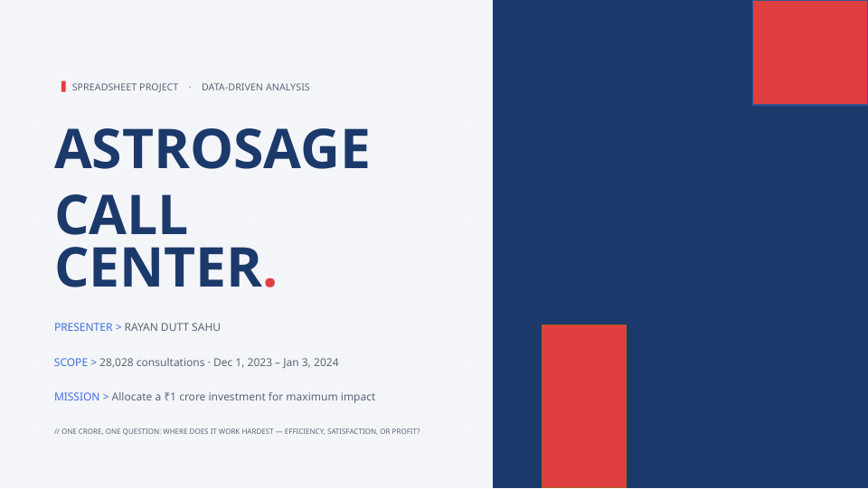
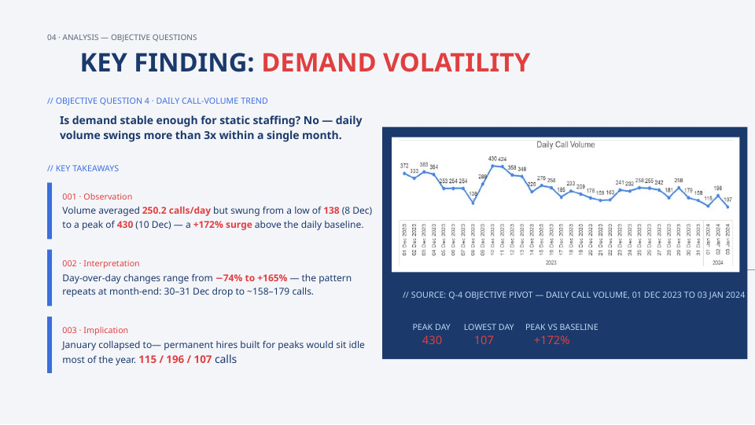
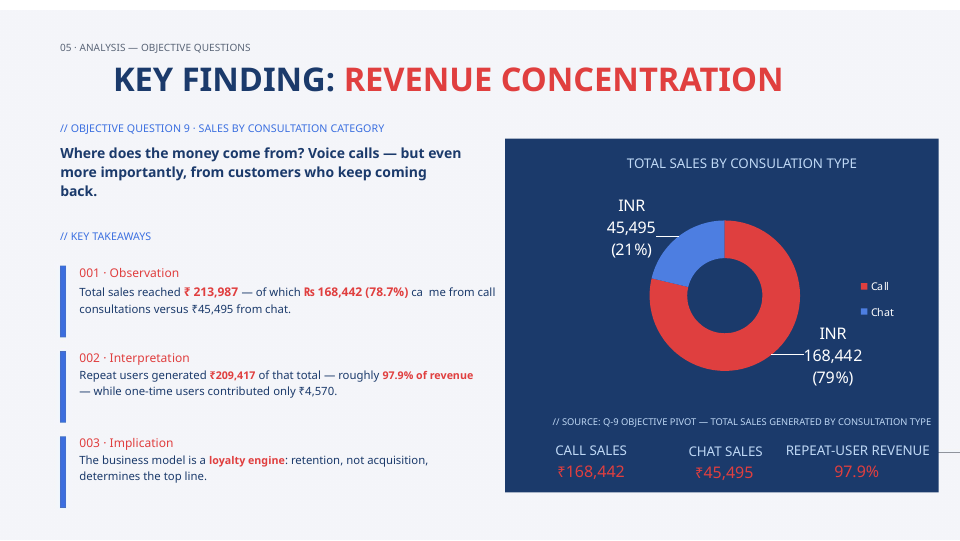
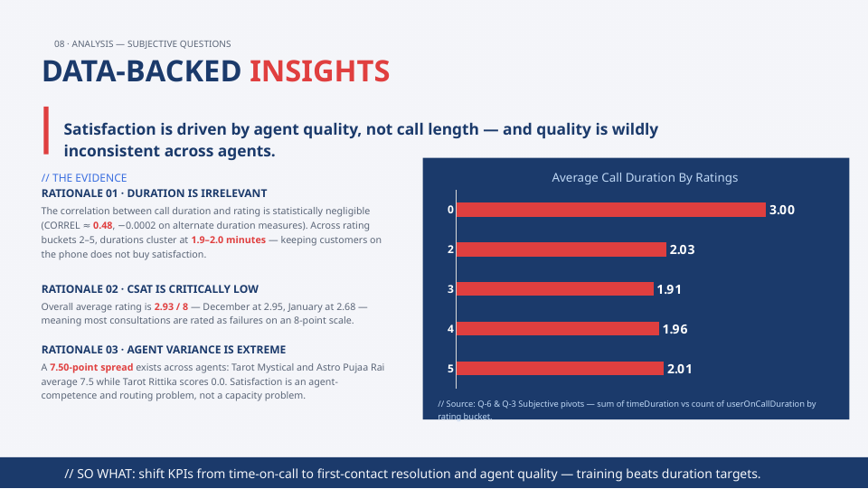
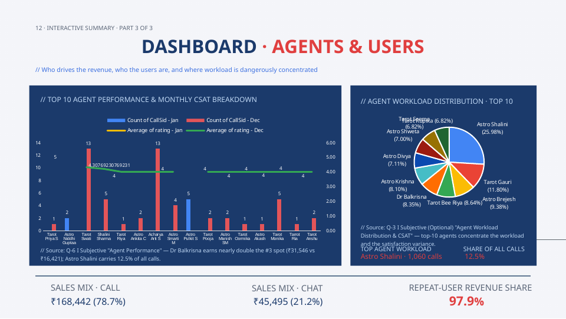

# AstroSage Call Center: Data-Driven Operational Analysis & Investment Strategy

## Overview

Welcome to the **AstroSage Call Center Analysis** repository. This project represents an in-depth, end-to-end data analytics engagement designed to evaluate customer service operations, revenue streams, and agent performance across **28,028 consultations** recorded between December 1, 2023, and January 3, 2024. Commissioned as an exploratory study to allocate a hypothetical **₹1 Crore strategic investment**, this project bridges raw operational telemetry and actionable business intelligence.

By transforming 19 raw workbook tabs into a unified, sanitized analytical model, this study investigates call volume volatility, agent workload distribution, revenue concentration, and customer satisfaction metrics. The findings challenge conventional call center assumptions, proving that customer retention and agent competence significantly outweigh brute-force call duration in driving sustainable business growth.

---

## Executive Summary & Visual Architecture

To provide immediate context into the scope and visual storytelling of the analysis, the project incorporates a professional presentation deck and spreadsheet dashboards. Below is the primary project cover representing the analytical framing:



The analysis addresses a central strategic dilemma: how to allocate capital for maximum impact across three competing operational vectors: **agent headcount expansion**, **targeted training programs**, and **technology infrastructure upgrades**. Through rigorous pivot table aggregations, correlation modeling, and what-if scenario testing, the project delivers a definitive roadmap for operational restructuring.

---

## Analytical Methodology & Data Pipeline

The project follows a rigorous four-stage data pipeline, ensuring data integrity and analytical robustness before any statistical modeling was performed. 

| Pipeline Stage | Operations Performed | Analytical Objective |
| :--- | :--- | :--- |
| **1. Data Collection & Assessment** | Consolidated 19 disparate spreadsheet tabs into a single primary table containing **28,028 rows** of transactional data. | Establish a unified source of truth for all downstream calculations and aggregations. |
| **2. Data Cleaning** | Removed duplicate records, standardized inconsistent agent names using `Find & Replace`, imputed missing categorical values with `N/A`, and assigned `0.00` to blank revenue fields. | Eliminate data anomalies and prevent skewed statistical outputs during aggregation. |
| **3. Data Enrichment** | Extracted temporal variables (`Day`, `Month`, `Year`, `Date`), computed call durations in seconds, and binned users into distinct behavioral segments. | Enable granular time-series analysis and cohort-based customer segmentation. |
| **4. Advanced Modeling** | Executed pivot aggregations (`COUNT`, `SUM`, `AVERAGE`), Pearson correlation testing (`CORREL`), and Scenario Manager modeling. | Uncover hidden operational bottlenecks, revenue drivers, and investment risk profiles. |

---

## Key Findings & Insights

### 1. Demand Volatility & Capacity Constraints
Analysis of daily call volumes reveals extreme operational instability. While the overall average daily volume rests at **250.2 calls per day**, customer demand swings dramatically from a low of **138 calls** on December 8 to a peak of **430 calls** on December 10—representing a **+172% surge** above the baseline. 

> "Demand volatility invalidates static staffing models. Permanent headcount expansion built to absorb peak seasonal surges leaves agents severely underutilized during trough periods, such as January."

The visualization below details the day-to-day call volume fluctuations and highlights the severe operational peaks handled by the call center:



### 2. Revenue Concentration & The Loyalty Engine
Evaluation of revenue generation across consultation categories indicates that voice calls dominate the top line, generating **₹168,442 (78.7%)** of total sales, compared to **₹45,495 (21.2%)** from chat consultations. More importantly, cohort tracking reveals that **97.9% of total revenue** originates from repeat callers.

| Consultation Type | Total Sales (INR) | Revenue Share (%) | Primary Driver |
| :--- | :--- | :--- | :--- |
| **Voice Calls** | ₹168,442.03 | 78.7% | High-engagement advisory sessions |
| **Chat Consultations** | ₹45,494.68 | 21.2% | Asynchronous quick inquiries |
| **Public Live Calls** | ₹50.60 | <0.1% | Broadcast interactions |
| **Total Revenue** | **₹213,987.31** | **100.0%** | **Driven 97.9% by Repeat Users** |

The following donut chart illustrates the distinct revenue concentration across consultation channels:



### 3. Service Quality & Agent Variance
Customer satisfaction (CSAT) across the dataset remains critically low, registering an overall average of **2.93 out of 8**, with December averaging **2.95** and January dropping to **2.68**. Pearson correlation testing between call duration and customer rating yielded a coefficient of **0.48**, indicating only a moderate positive relationship. Across rating buckets, call durations consistently cluster between **1.9 and 2.0 minutes**, proving that keeping a customer on the line longer does not automatically yield satisfaction.



As demonstrated in the agent performance and workload distribution dashboard below, satisfaction variance is strictly an agent-level competence issue rather than a systemic duration constraint:



---

## Strategic Recommendations & Investment Roadmap

Based on empirical findings from the dataset, the proposed **₹1 Crore strategic investment** should be deployed according to the following phased priorities:

1. **Adopt Flexible Rostering over Permanent Hiring**: To mitigate the risks of idle wage drain during trough months (such as January, which collapsed to 418 total calls), the organization must implement flexible contractor agreements and dynamic scheduling during peak seasonal surges.
2. **Shift KPIs from Duration to First-Contact Resolution (FCR)**: Since call duration does not correlate directly with customer ratings, management must dismantle arbitrary talk-time targets and instead reward agents for problem resolution quality.
3. **Targeted Agent Upskilling**: Addressing the extreme performance spread—where top agents like Tarot Mystical and Astro Pujaa Rai average **7.5 CSAT**, while underperformers drop to **0.0**—requires immediate, mandatory coaching workshops modeled after top-tier performers.
4. **Automated Queue Balancing**: Implementing virtual callback queues during high-volume surges (>300 calls/day) will eliminate customer friction points, protect agent morale, and preserve retention-driven revenue.

---

## Repository Structure

```text
├── assets/
│   ├── cover.png                # Project presentation title cover
│   ├── daily_call_volume.png    # Time-series daily volume trend chart
│   ├── revenue_concentration.png# Consultation sales breakdown donut chart
│   ├── duration_vs_ratings.png  # Correlation and duration analysis chart
│   └── agent_dashboard.png      # Top agent workload and performance dashboard
├── docs/
│   └── AstroSage_Project_Report.docx # Complete detailed project write-up
└── README.md                    # Comprehensive project documentation
```

---

## Author

**Rayan Dutt Sahu**  
*Aspiring Data Analyst | Bachelors in Computer Applications in Data Science*  
[LinkedIn Profile](https://linkedin.com/in/r-ds-05071216r/) | [GitHub Portfolio](https://github.com/r-DS16)
